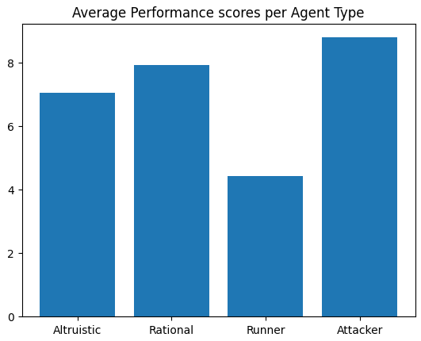
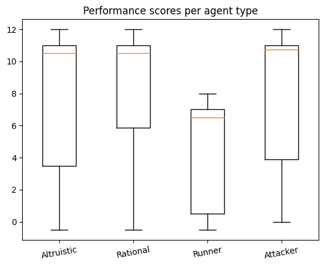

# SC2-RunMarine
Door: 
- Bram van Leusden (script-kidie)
- Justin Klein (StarGazer1915)
- Rutger Willard (unknownZandbak)
- Youssef Boulfiham (Youssef-Boulfiham)

# ADB-2 (Single-agent)
## Inrichting omgeving
De simulatie vind plaats in het spel StarCraft II en wordt aangestuurd met behulp van een python API genaamd: `sc2`. We hebben voor deze API gekozen aangezien alle leden het beste met deze python variant overweg kunnen. Ook is veel documentatie en uitleg over de API beschikbaar via de link: https://pythonprogramming.net/commanding-army-starcraft-ii-ai-python-sc2-tutorial/. Hiernaast heeft starcraft 2 zijn eigen map builder en is/was het voor ons eenvoudig om meerdere omgevingen/situaties op te zetten voor onze simulaties. 

In de huidige simualtie probeert een agent (Marine) weg te rennen van een dodelijke vijand (Baneling). De tegenestander wordt aangestuurd door een computer en is hierdoor een onderdeel van de omgeving. De Agent heeft zijn eigen logica en waarneming van de omgeving waarmee hij een route probeert te vinden om te kunnen vluchten van de Baneling. Er zijn meerdere maps beschikbaar om deze functionaliteit in uit te testen. Wij hebben de functionaliteit van de Agent voornamelijk getest binnen de `marine_vs_baneling_advanced_NoOverlord` map.

## Architectuur, logica en onzekerheid
Als code architectuur is er uiteraard gekozen voor OOP, hiermee kunnen we het gedrag van één Agent makkelijk laten afwijken van een andere Agent zodat hopelijk in de toekomst meerdere inviduele agents de omgeving anders kunnen waarnemen (http://www2.econ.iastate.edu/tesfatsi/ABMAOPAMES.LT.pdf). Om eerst de interpretatie van de wereld goed te laten functioneren is er op dit moment één agent die probeert te vluchten. Het doel van onze agent is om te overleven. Deze agent beweegt door de omgeving heen (en staat stil wanneer er geen gevaar is) en geeft ieder coördinaat die hij ziet een score voor 'veiligheid'. Een coordinaat wordt als minder veilig beschouwt als deze zich in de buurt van muren bevindt en/of als de Agent ziet dat dit coördinaat in het zicht is van de tegenstander (de agent wilt namelijk uit het zicht blijven). Wanneer de Agent alle posities heeft beoordeeld kijkt hij eerst naar de hoogst scorende coördinaat. In het geval dat er meerdere coordinaten zijn met dezelfde score, dan pakt de agent het coördinaat welke het meest ver is van de Baneling. Wanneer de agent begint met vluchten heeft hij nog niet alle coordinaten verkend en weet de Agent dus niet waar wel en geen loopbaar terrein zich bevindt (onzekerheid). De agent aanschouwt alles wat nog niet verkend is als onloopbaar terein, hiermee voorkomt de agent dat hij naar een hoek loopt en zo kiest hij er juist voor om voorzichtig langzaam het onverkende gebied te verkennen. Het kan wel echter voorkomen dat hij het onbekende terrein zal moeten verkennen aangezien de Baneling hem aan het opjagen is.

# ABD-4 (Multi-agent)
## Inrichting omgeving 
Qua tools is alles hetzelfe gebleven en zijn we OOP gaan programmeren, vooral de opzet van de omgeving is erg aangepast zodat het experiment kon worden uitgevoerd. In de map `12SquareMarinevsBanelingslow2` zijn er 12 pilaren met allemaal verschillende opzetten van 2 Marines en een Baneling. Op iedere van deze twee pilaren wordt een situatie geforceerd waarbij 2 Marines de keuze moeten maken uit vluchten voor de baneling of juist de baneling aanvallen. Als beide Marines de baneling aanvallen zullen ze altijd de baneling doodkrijgen en als er maar 1 Marines aanvalt lukt het soms. In het geval dat de 2 Marines vluchten zal de baneling uiteraard niet worden vermoord. Ook verdienen agenten punten voor: de tijd zie ze hebben overleefd, het overleven tot het einde van de simulatie en voor het doden van de Baneling als ze ook hebben deelgenomen aan de aanval.   *layout van de omgeving

## Opzet experiment 
In onze simulatie zijn er vier typen Marines aanwezig, waarbij drie concepten uit de theorie worden toegepast op deze typen Marines. Er zijn twee Marines die een "pure strategy" hanteren, namelijk de "runner" (vlucht altijd) en de "attacker" (valt altijd aan). Daarnaast is er een Marine die altijd kiest voor "Pareto optimality" en dus altruïstisch is en ook nog een rationele Marine die altijd kiest voor de "Nash equilibrium" en aanmeemt dat de andere agent ook rationeel is. De altruïstische en rationele Marine baseren hun keuzes op de matrix in het bestand `action_matrix.json`, die constant wordt geüpdatet met de scores van iedere waarneming die is gedaan door een niet pure strategy agent. Voor dit experiment werd er gekeken naar welke theorie het best presteert binnen de beschreven simulatie. Met de uiteindelijke onderzoeksvraag: "Welk concept uit de theorie krijgt de hoogste score" en de Hypothese: "De agent die maar de Nash equilibrium zoekt scored het hoogst". 

## Uitvoering experiment 
De omgeving is 20 keer gesimuleerd, waarbij de scores en gegevens uit de matrix in action_matrix.json steeds zijn doorgegeven aan de volgende simulatie. Ook worden de scores van iedere Marine bijgehouden en wegescherven. Iedere simualtie zijn de plaatsingen van iedere type agent en zo ook de gebruikte theorien willekeurig bepaald, zodat de resualten wat meer representatief zouden zijn van een simulatie die deze situaties van 1 Baneling en 2 Marines niet zou forceren. 

## Resultaten 
### analyze 
Vanuit de gemiddelde waarden per type agent in de onderstaande barplot, is duidelijk te zien dat de attacker Marine het beste scoort en de runner Marine het slechtste. Echter, doordat beide Marines een zuivere strategie hanteren, is de gemiddelde score van dat concept erg laag. Ook scored de rationele Marine niet veel lager dan de attacker Marine. Daarnaast is te zien in de boxplots dat de standaarddeviatie van de rationele agenten veel lager is. 

### grafieken 
 
 

## Conclusie 
Op basis van het experiment blijkt dat de agent die streeft naar het vinden van het Nash equilibrium niet de hoogste gemiddelde score haalt, in tegenstelling tot de hypothese. Uit de resultaten blijkt dat de attacker Marine het best presteert, terwijl de runner Marine het slechtste scoort. Dit is echter te wijten aan het feit dat beide Marines een Pure strategy hanteren, wat resulteert in een lage gemiddelde score van dat concept. Opvallend is dat de rationele Marine niet veel lager scoort dan de attacker Marine, maar wel een veel lagere standaarddeviatie heeft. Dit impliceert dat de rationele agenten vaker hogere scores behalen dan andere Marines. In het algemeen kan worden geconcludeerd dat de prestaties van de Marines afhankelijk zijn van het gebruikte concept uit de theorie en dat het hanteren van een Pure strategy kan leiden tot lagere scores. En dat Marines die de Nash equilibrium hanteren voor meer consistentere hogere scores zorgen tegenover de andere gebruikte concepten van dit experiment. 

## Discussie 
### verloop 
Over het algemeen verliep deze opdracht beter dan de vorige, maar we hadden nog steeds veel problemen met de communicatie. Zo zijn er bijvoorbeeld verschillende branches met de `main` samengevoegd zonder dat we daarover hadden overlegd, wat leidde tot twee uur tijdsverlies om alle bestanden te herstellen. Daarnaast waren er nog andere gevallen van slechte communicatie en was er ook veel ruimte voor verbetering bij de planning van deze opdracht.

### Voor de volgende keer
In het vervolg lijkt het ons verstandig om eerst een duidelijke rol- en taakverdeling te maken, evenals een heldere planning. Daarnaast zullen we ook afspraken maken over de uitvoering van het project, om te voorkomen dat er zonder overleg wordt afgeweken van het algemene plan. Zo kunnen we voorkomen dat er drastische acties worden ondernomen die uiteindelijk onbruikbaar of zelfs schadelijk blijken te zijn voor de opdracht.

## Gebruik
Om de simulatie te starten kunt u het `main.py` bestand uitvoeren. Let op dat u hiervoor wel een aantal libraries/packages, waaronder `sc2`, geïnstalleerd moet hebben. Zie hiervoor de imports van de `main.py`, `GameBot.py` en `MarineAgent.py` bestanden. Ook moet u uiteraard StarCraft II gedownload hebben op uw computer/machine om de omgevingen te kunnen laden.

# Bronnen 
- http://www.masfoundations.org/ 
- https://www.youtube.com/watch?v=6rs_EQpxTI4 
- https://www.youtube.com/watch?v=idHVAUEeaqE 
- https://www.youtube.com/watch?v=9zYI7t-CxX4 
- https://www.youtube.com/watch?v=XwhFq8WwTtA
